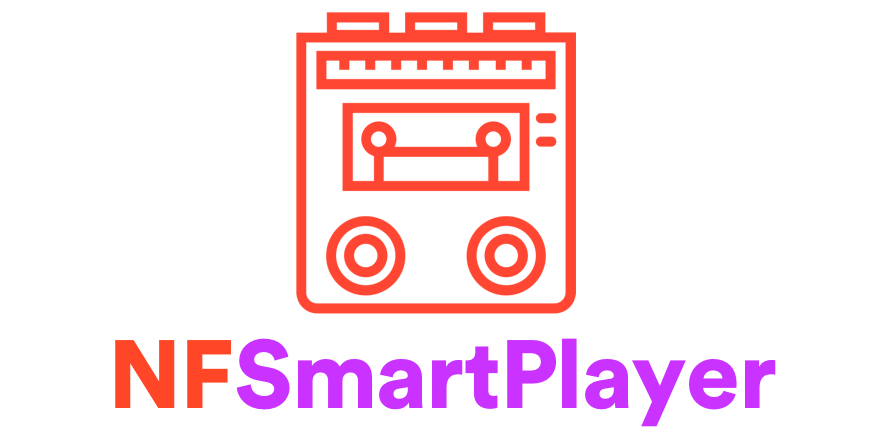

[](https://circleci.com/gh/spotify/NFSmartPlayer)

[](LICENSE)
[](http://clayallsopp.github.io/readme-score?url=https://github.com/spotify/NFSmartPlayer)

A cross platform streaming audio engine with a declarative format.

- [x] 📱 [iOS](https://www.apple.com/ios/) 9.0+
- [x] 💻 [OS X](https://www.apple.com/macos/) 10.11+
- [x] 🐧 [Ubuntu](https://www.ubuntu.com/) Bionic 18.04+
- [x] 🤖 [Android](https://developer.android.com/studio/) SDK r17+

Developed at Spotify 2019-2022, Discontinued and handed over to new maintainers January 2023

## Raison D'être :thought_balloon:

We dreamed of an audio engine that could multitrack, stream long audio, apply audio effects, react to user input through a scripting layer, be resource-light, and work on the majority of platforms. We wanted to bring new audio experiences to both listeners and creators, without requiring a degree in audio engineering.

We created a declarative format to describe the audio and effects over time, known as [NFGrapher](https://github.com/spotify/NFGrapher). This C++ smart player consumes JSON produced by NFGrapher, and outputs audio in either realtime to the audio driver or faster-than-realtime (offline to a file).

Via [NFDecoder](https://github.com/spotify/NFDecoder) and [NFHTTP](https://github.com/spotify/NFHTTP), it can stream audio files from the file system, over HTTP(S), or through DASH (HLS) transmuxing.

## Architecture :triangular_ruler:

The NFSmartPlayer has two roles:

- An orchestrator between NFGrapher (a description of the audio playback), NFHTTP (get the data listed in NFGrapher), and NFDecoder (decode the data into samples)
- An audio plugin framework responsible for traversing the audio graph defined by NFGrapher, processing audio samples via plugins, and mixing those samples into a stereo audio frame

### Plugins

Audio plugins are located in [source/plugins](source/plugins). They correspond to the NFGrapher schema. These links contain the full list of plugins and parameters for audio manipulation:

- [Score Schema](https://github.com/spotify/NFGrapher/blob/master/score-schema.json)
- [Plugin Documentation](https://github.com/spotify/NFGrapher/blob/master/doc/smartplayer.md)

## Dependencies :globe_with_meridians:

### Build dependencies

These dependencies must installed manually or using the [ci scripts](ci/README.md). They vary by platform.

Common:
- [CMake](https://cmake.org/)
- [swig](http://www.swig.org/)
- [python](https://www.python.org/)
- [JDK](http://www.oracle.com/technetwork/java/javase/downloads/index-jsp-138363.html)
- LCOV
- FFMPEG
- clang
- clang-format
- boost
- gyp

OS X:
- x264
- LAME
- XCode

Linux:
- ninja-build
- libcurl4-openssl-dev
- libc++-dev
- libasound2-dev

### Submodules
These dependencies will be included as submodules and compiled from source automatically when CMake is run.

- [NFDriver](https://github.com/spotify/NFDriver)
- [NFDecoder](https://github.com/spotify/NFDecoder)
- [NFLogger](https://github.com/spotify/NFLogger)
- [NFGrapher](https://github.com/spotify/NFGrapher)
- [PeqBank](https://github.com/spotify/PeqBank)
- [duktape](https://github.com/svaarala/duktape-releases.git)
- [gyp](https://chromium.googlesource.com/external/gyp)
- [OSCPack](https://github.com/MariadeAnton/oscpack)


## Installation :inbox_tray:

`NFSmartPlayer` is a [Cmake](https://cmake.org/) project. While you are free to download the prebuilt static libraries it is recommended to use Cmake to install this project into your wider project. In order to add this into a wider Cmake project, add the following line to your `CMakeLists.txt` file:

```
add_subdirectory(NFSmartPlayer)
```

### For iOS/OSX
Generate an [Xcode](https://developer.apple.com/xcode/) project from the Cmake project:
```shell
$ git submodule update --init --recursive
# install gyp locally
$ virtualenv --python=$(which python2) smartplayer_env
$ source smartplayer_env/bin/activate
$ pushd tools/gyp
$ python setup.py install
$ popd
# run cmake
$ mkdir build
$ cd build
$ cmake .. -GXcode
```

### For Linux
Generate a [Ninja](https://ninja-build.org/) project from the Cmake project like so:
```shell
$ git submodule update --init --recursive
# install gyp locally
$ virtualenv --python=$(which python2) smartplayer_env
$ source smartplayer_env/bin/activate
$ pushd tools/gyp
$ python setup.py install
$ popd
# run cmake
$ mkdir build
$ cd build
$ cmake .. -GNinja
```

### Docker Build (Linux/Mac)

The CI scripts build an environment from scratch (apt-get, python virtualenv, gyp, etc), which is time consuming. One way to reduce that time is to build a linux container for the tools once, and then use your local filesystem for development. Note: This does NOT allow you to compile native Mac binaries, for example. For that, you still need to setup the proper environment.

```sh
# Build the env
DOCKER_BUILDKIT=1 docker build -f ci/Dockerfile -t smartplayer-env .

# Use your local directory with the env container
# WARNING: this will modify your local file system!
docker run --rm -it -v $(PWD):$(PWD):cached -w $(PWD) smartplayer-env /bin/bash

# Or to run a ci script directly:
docker run --rm -it -v $(PWD):$(PWD):cached -w $(PWD) smartplayer-env python ./ci/linux.py build
```

## Usage example :eyes:

The SmartPlayer library comes with an example CLI "host" program in [source/cli/main.cpp][./source/cli/main.cpp].

```sh
$ ./build/source/cli/NFSmartPlayerCLI --help
Native Format Command Line Interface 2530-ea20b067
Allowed options:
  --help                                produce help message
  --input-file arg                      tells the player where to get the graph
                                        from
  --resolved-variables arg              variables to resolve in the player, in
                                        the format of CSV
  --driver-type arg (=sound)            driver type to render to
  --driver-file arg (=/Users/drewp/dev/OSSNFSmartPlayer/nfsmartplayer.wav)
                                        driver file to render to
  --render-time arg (=0)                The time to start rendering at

```

Play a Score from the file system:

```sh
$ ./NFSmartPlayerCLI --input-file ./path/to/score.json
```

## Contributing :mailbox_with_mail:
Contributions are welcomed, have a look at the [CONTRIBUTING.md](CONTRIBUTING.md) document for more information.

## License :memo:
The project is available under the [Apache 2.0](http://www.apache.org/licenses/LICENSE-2.0) license.

### Acknowledgements
- Icon in readme banner is "[music player](https://thenounproject.com/search/?q=cassete&i=1394525)" by SBTS from the Noun Project.
- Integration test is from [Wikimedia](https://en.wikipedia.org/wiki/File:ACDC_-_Back_In_Black-sample.ogg)

## Contributors

Primary contributors to this repository at the time of open sourcing:

* [Will Sackfield](https://github.com/8W9aG)
* [Justin Windle](https://github.com/soulwire)
* [Julia Cox](https://github.com/astrocox)
* [Drew Petersen](https://github.com/kirbysayshi)
* [Justin Sarma](https://github.com/jsarma)
* [David Rubinstein](https://github.com/drubinstein)
* [Noah Hilt](https://github.com/noeski)
* [Jose Falcon](https://github.com/josefalcon)
* [Tristan Jehan](https://github.com/tjehan)
